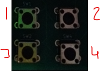

# PicoWOL

Rasberry Pi Pico to send WOL packets

This project provides both physical and remote means to wake up machines configured with wake-on-lan.

## Documentation
To generate documentation Doxygen must be installed, simply call doxygen in the root folder of this project and doxygen documentation will be generated.

## Third Party Dependencies
This project relies on [carlk3's](https://github.com/carlk3/no-OS-FatFS-SD-SPI-RPi-Pico) great work in creating an sd card library for the Rasberry Pi Pico.

## Aquiring Hardware
To see how to aquire required hardware see [readme](pcb_board/README.md).

## Usage

This program allows the picowol to turn machines on through [Wake-on-lan](https://en.wikipedia.org/wiki/Wake-on-LAN). Pico_WOL can either turn machines by using physical buttons on the device or sending a UDP packet (see ...) to the microcontroller's ip to turn the requested device on. The precompiled uf2 file sets External components to certain GPIO pins on the pico, these will be listed in case you wish not to buy a pcb.

- [Physical Buttons](#physical-buttons)
- [Micro SD Card Reader](#micro-sd-card-reader)
- [Display](#display)

### Physical Buttons

The list below provides detail of what each button does and the mappings via GPIO to the Rasberry Pi Pico.

1. Allows the User to cycle between profiles, moving left. - GPIO 14
2. Provides basic information about the wireless pico, IP Address and the port in use (If you want to send packets to server) - GPIO 19
3. Allows the User to cycle between profiles, moving right. - GPIO 15
4. Wakes the selected profile. - GPIO 18

### Micro SD Card Reader

This reader is responsible in loading profiles and getting neccessary details to connect to the network.

#### Reading WiFi credentails

This program expects the file 'wifi_credentials.txt' to be at the base of the SD card in which will store the required credentials.
The credentials are seperated via semi colons and in the structure: SSID;SSID_PASSWORD i.e. VM112121;password123

#### Reading Wake On Lan Profiles

This program currently expects all profiles to be loaded in a singular file called 'wol_profiles.txt' which stores the name of the profile and its respective IP Address. 
The structure of storing profiles is as so: PROFILE_NAME;MACADDRESS ie gaming_pc;60ABDBA2A2A8.

Such that the file looks like this:

- Profile1;60ABDBA2A2A8
- Profile2;60ABDBA2A2A9
- Profile3;60ABDBA2A2AA

#### GPIO Connections

- SPI Chip Select - GPIO 13
- SPI RX - GPIO 12
- SPI TX - GPIO 11
- SPI SCK - GPIO 10

## Display

This display enables the user to view the currently selected profile.

The GPIO Mappings are as so:
- I2C_SDA - GPIO 16
- I2C_SCL - GPIO 17

## Potential future Improvements

This project was mainly a way for myself to learn more about microcontrollers and become more familiar with technologies like CMake and Doxygen.
However this program could do with a few improvements, mainly:

-   Wake on lan profile to be read across multiple files
-   Wake on lan profiles can be saved via UDP packets to Pico UDP server
-   Seperate Display from Pico Server, such that the server starts, even when the display is not initialised (working headless)

