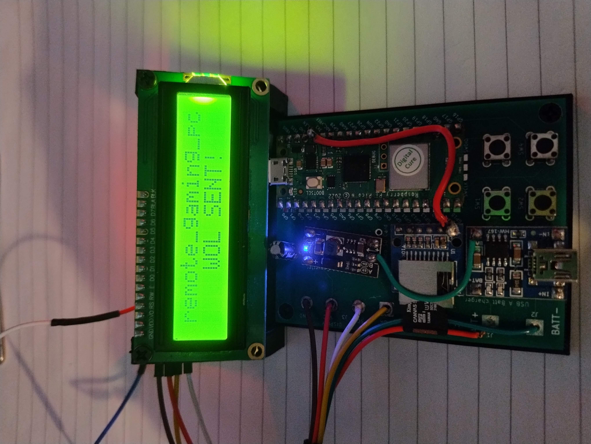

# Hardware aquirement
This readme covers gathering relevant parts for the final build

## KiKad Project

This contains directory components gathered from my KiKad project, this should allow anyone to either grab gerber files needed for print or regenerate the gerber files needed.

## Case

I've created a STL file to hold both the display and the provided PCB Board, [here](case/case.stl).

## Build Components

Below is a list of components used to build the project:

- [Rasberry pi pico wireless (soldered heads)](https://www.amazon.co.uk/DVOZVO-Raspberry-Pre-Soldered-Wireless-Connectivity/dp/B0BV1H4D7M/ref=sr_1_3?crid=38OD8XVM6FVOO&dib=eyJ2IjoiMSJ9.5rrltWqY9Rv3jpucgPGsIn_evCD9ElsqvSv3SyBkfBBdMS7BwKJBqI7jxlJDz_RYciQIycxvgjo9YFPT91diZXax1RgA821CUeKQQcpJ5ATvFS5mBq9dWzCbHII750q_0em2XcvZniiZofDEysHM3SiygeNd2Ke7NYam3Ru6180VWZFca0piPCD7Os2bQN3DHKl01l27eNVioleXR6OzugXnwsqrYtdG9qZ9_y3JrL4.f-zRNYZM28hRcX_Qza0ZqilIpFJtvcGUtWd_xj9ochU&dib_tag=se&keywords=raspberry+pi+pico+wireless&qid=1721581385&sprefix=rasberry+pi+pico+wirelss%2Caps%2C102&sr=8-3)

- [M3 screws](https://www.amazon.co.uk/dp/B08J3KY5RM?psc=1&ref=ppx_yo2ov_dt_b_product_details)

- [M3 screw threads](https://www.amazon.co.uk/dp/B0CYH466PM?psc=1&ref=ppx_yo2ov_dt_b_product_details)

- [5V charging board](https://www.amazon.co.uk/dp/B09NX3QDKF?psc=1&ref=ppx_yo2ov_dt_b_product_details)

- [Lithium battery](https://www.amazon.co.uk/dp/B08ZCQXFX4?psc=1&ref=ppx_yo2ov_dt_b_product_details)

- [Boost converter (3.7v to 5v)](https://www.amazon.co.uk/dp/B0C3QLH284?psc=1&ref=ppx_yo2ov_dt_b_product_details)

- [Micro SD Card reader](https://www.amazon.co.uk/dp/B09YYG6BT3?psc=1&ref=ppx_yo2ov_dt_b_product_details)

- [LCD Display (1602 I2C)](https://www.amazon.co.uk/dp/B09YYG6BT3?psc=1&ref=ppx_yo2ov_dt_b_product_details)

- [100u Capacitor (any would do really)](https://www.amazon.co.uk/s?k=100u+capacitor&crid=16SIGP58YYNJG&sprefix=100u+capacitor%2Caps%2C72&ref=nb_sb_noss)

- Wire (Im guessing you can source this yourself)

## Final Look
This is roughly what the final design would look like, ignore any jerry rigging of wires, this was due to my own created errors.

